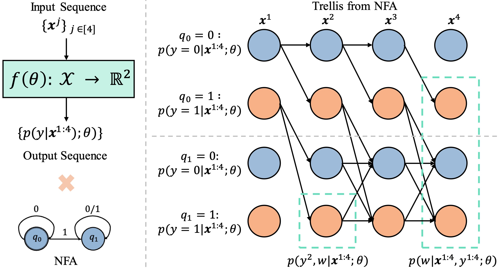
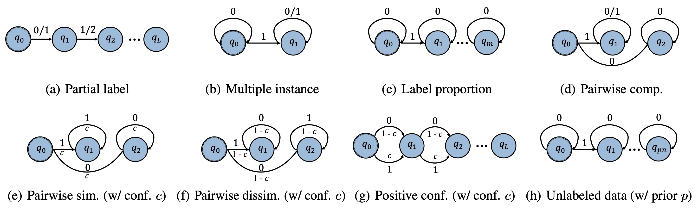

# General-Framework-Weak-Supervision
This repo provides the codebase for paper "[ICML 2024] A General Framework for Learning from Weak Supervision" [[GLWS]](https://arxiv.org/abs/2402.01922).
It accomidates 14+ weak supervision settings, with baselines implemented and comprehensive benchmarks provided. 

# Change Log
* 05/2024 Paper accepted by ICML 2024!
* 02/12/2024 Initial Code Released!


# TL;DR
We provide a unified framework - GLWS, for learning from arbitrary forms of weak supervision, where the labels result from reduced standard training annotations, including inexact, incomplete, and inaccurate supervision.
Our unified framework achieves comparable performance to the state-of-the-art methods on the 14+ implemented settings, and more importantly and practically, demonstrates significant robutness on the mixture of various weak supervision.




# Training 

Our implementation and weak supervision settings includes:
* Partial Label Learning
* Semi-Supervised Learning
* Noisy Label Learning
* Partial Noisy Semi-supervised Learning
* Multiple Instance Learning
* Learning with Label Proportion
* Pairwise Comparision Learning
* Pairwise Similarity Learning
* Similarity Confidence Learning
* Confidence Difference Learning
* Postive Confidence Learning
* Positive Unlabeled Learning
* Unlabeled Unlabeled Learning
* Similarity Dissimilarity Unlabeled Learning
* ...more coming soon...

Core of our method is to model different weak supervision as a Non-deterministic Finite Automaton (NFA), which summarizes the possible labelings over the inputs with a sequential view. An EM objective is then optimized on the trellis expanded from the NFA with forward-backward algorithm. 
Notebly, learning from arbitrary weak supervision is now converted to modeling NFA of differeent weak supervision.
More details are in our paper.



Following are some examples of traning in different settings.


## Partial Label Learning

Partial label learning involes training model with a set of label candidates, instead of single definite labels. We provide config files on CIFAR-10 with partial ratio [0.1, 0.3, 0.5], 
and on CIFAR-100 with partial ratio [0.01, 0.05, 0.1].

```
CUDA_VISIBLE_DEVICES=0 python train.py --c config/partial_label/classic_cv/partial_label_cifar10_0.1_42.yaml
```

## Noisy Label Learning

Noisy label learning involes training with corrupted/incorrect labels. Our formulation becomes the first working method comparable to state-of-the-art with a specific noise transition model. We conduct experiments on synthetic noise of CIFAR-10 and CIFAR-100, and practical noise of CIFAR-10N, CIFAR100N, Clothing1M, and Webvision.


```
CUDA_VISIBLE_DEVICES=0 python train.py --c config/noisy_label/classic_cv/noisy_label_cifar100_sym_0.5_42.yaml
```


## Partial Noisy Semi-Supervised Learning

More importantly and more practically, our unified formulation can extend to any imprecise label settings, and the combination/mixture of various imprecise label configurations. We provide experiment config files with CIFAR-10 and CIFAR-100.


```
CUDA_VISIBLE_DEVICES=0 python train.py --c config/partial_noisy_ulb/classic_cv/imp_partial_noisy_ulb_cifar10_lb1000_n0.2_p0.3_42.yaml
```


## Multiple Instance Learning

Multiple instance learning assumes the weak supervision as the statistics over a group of instances, as an indicator whether positive instance is inside the group.

```
CUDA_VISIBLE_DEVICES=0 python train.py --c config/multi_ins/classic_cv/count_loss_multi_ins_cifar10_target10_bags10000_mean5_std1_42.yaml
```

## Other Settings
Other settings can be run similarily as the above examples, using the confis specified in config folder.


# Citation
If you find this repo and papers helpful for your project, please consider cite us!
```
@article{chen2024general,
  title={A General Framework for Learning from Weak Supervision},
  author={Chen, Hao and Wang, Jindong and Feng, Lei and Li, Xiang and Wang, Yidong and Xie, Xing and Sugiyama, Masashi and Singh, Rita and Raj, Bhiksha},
  journal={arXiv preprint arXiv:2402.01922},
  year={2024}
}

@article{chen2023imprecise,
  title={Imprecise label learning: A unified framework for learning with various imprecise label configurations},
  author={Chen, Hao and Shah, Ankit and Wang, Jindong and Tao, Ran and Wang, Yidong and Xie, Xing and Sugiyama, Masashi and Singh, Rita and Raj, Bhiksha},
  journal={arXiv preprint arXiv:2305.12715},
  year={2023}
}
```


# Results
Please refer to our paper (and appendix) for full results. We also release all the training log files. [Google Drive](https://drive.google.com/drive/folders/1uG_HZAmpY0jOrInt6aKVLMLPAXhG91G7?usp=sharing)


# Acknowledge
This codebase is largely based on the [USB codebase](https://github.com/microsoft/Semi-supervised-learning).
